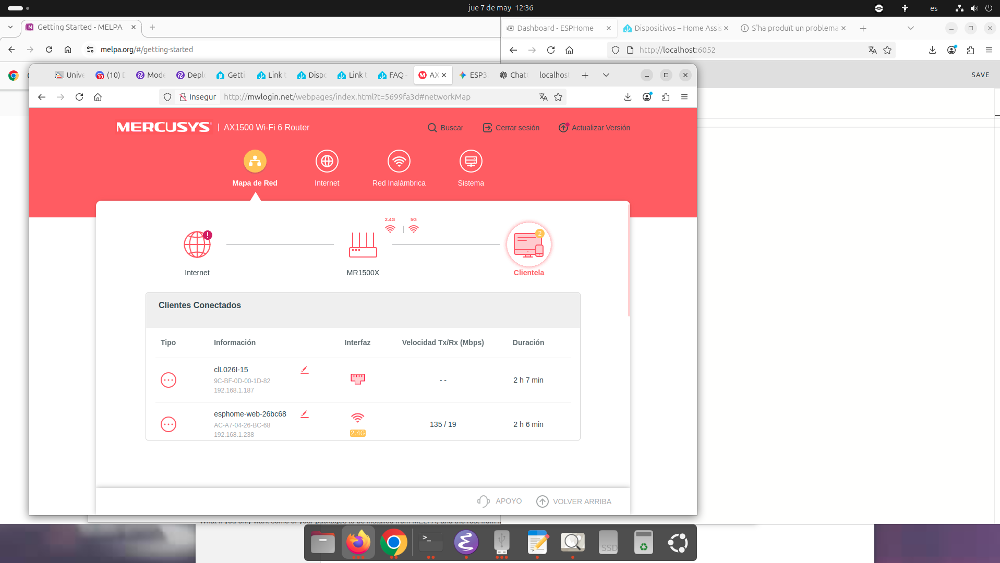

# IMCR 2025-26

# Frigate + CompreFace + Double-Take + Home Assistant — Test Stack

A fully wired local test environment for face recognition with NVR.

### 1. Start the stack

```bash
docker compose up -d --build
```

> First run takes a few minutes — CompreFace and Frigate are large images.

### 2. Wait for services to be healthy

```bash
docker compose ps
```

All services should show `healthy` or `running`.

---

## Service URLs

| Service        | URL                        | Notes                          |
|----------------|----------------------------|--------------------------------|
| Fake Camera    | http://localhost:8090      | /stream  /snapshot  /health    |
| Frigate UI     | http://localhost:5000      | NVR dashboard                  |
| CompreFace UI  | http://localhost:8000      | Face management                |
| Double-Take UI | http://localhost:3000      | Recognition events             |
| Home Assistant | http://localhost:8123      | HA dashboard                   |
| MQTT Broker    | localhost:1883             | Use any MQTT client to inspect |

---

## Setup Steps (after containers start)

### Step 1 — CompreFace: Create a Recognition Service

1. Open http://localhost:8000
2. Register an account (first user becomes admin)
3. Click **Create Application** → name it `frigate-test`
4. Inside the application, click **Create Service** → choose **Recognition**
5. Name it `people` → note the **API Key** shown

### Step 2 — Double-Take: Add the API Key

Edit `config/double-take/config.yml`:

```yaml
detectors:
  compreface:
    api_key: "PASTE-YOUR-API-KEY-HERE"   # ← replace this
```

Then restart Double-Take:

```bash
docker compose restart double-take
```

### Step 3 — CompreFace: Train Faces

You need to add at least one face before recognition works.

**Option A — via CompreFace UI:**
1. Open http://localhost:8000 → your application → Recognition service
2. Click **Add Subject** → enter a name (e.g. `Alice`)
3. Upload face photos for that subject

**Option B — via curl API:**
```bash
curl -X POST "http://localhost:8000/api/v1/recognition/faces" \
  -H "x-api-key: YOUR_API_KEY" \
  -F "file=@/path/to/face.jpg" \
  -F "subject=Alice"
```

## Credentials

| User            | Password          |
|-----------------|-------------------|
| frigate         | frigate123        |
| doubletake      | doubletake123     |
| homeassistant   | homeassistant123  |
| admin           | admin123          |

**Monitor all MQTT traffic:**
```bash
docker exec mosquitto mosquitto_sub \
  -h localhost -u admin -P admin123 \
  -t '#' -v
```

**Monitor just recognition results:**
```bash
docker exec mosquitto mosquitto_sub \
  -h localhost -u admin -P admin123 \
  -t 'double-take/#' -v
```

## Stopping / Resetting

```bash
docker compose down
```

## Troubleshooting

| Problem | Fix |
|---------|-----|
| Frigate not detecting | Check stream: `http://localhost:5000` → Cameras tab |
| CompreFace returns 401 | Wrong API key in double-take config.yml |
| Double-Take not receiving events | Check MQTT credentials and that Frigate is publishing |
| HA MQTT sensors unavailable | Confirm HA MQTT integration is connected (Settings → Integrations) |
| No faces recognized | Make sure you added + trained faces in CompreFace first |


# Tutorial muy rápido de cómo hacer esphome

Primero levanta el compose entero

Instala el router y espera hasta ver un ethernet por usb en `ip a` (empezando por `enx`). Cuando veas que tenga ipv4 procede al siguiente ítem.



Ve al sitio web que pone en la imagen. La password es P@c0Sanz1234.

Desde aquí, MEMORIZATE DE MEMORIA la ip del cacharro de esp32.

Ahora vete a http://localhost:6052/ y añade un nuevo dispositivo. Y en la configuración le metemos lo de `b.yml` y en secrets lo de `secrets.yml` en la parte superior derecha de la web.

Memorízate la clave de esp (parámetro `key`) porque es necesario para meterlo en el homeassistant. Si por lo que sea no va, desde el b.yml cambia el use_address a la dirección que te has memorizado antes. <3

Crea desde el homeassistant (que ya deberías saber cómo entrar si has ido a clase de teoría) el dispotivo. Y mete el ssid y pass del wifi y además la key de antes de encriptación.
